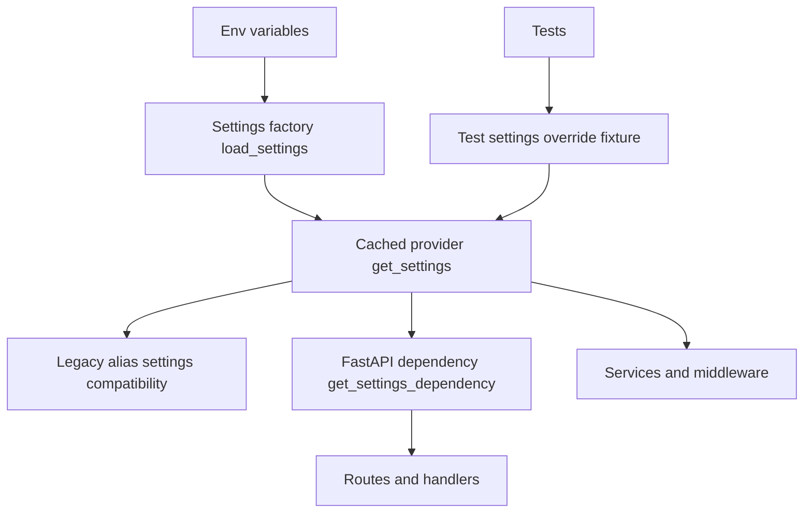

# Critical Fix #2 Plan - Global Mutable Settings State

Source issue: [`plans/code_review_report.md`](plans/code_review_report.md)

## Goal

Remove test-time mutation risk caused by global mutable [`settings = load_settings()`](app/config.py:194) while preserving runtime compatibility and avoiding regressions.

## Scope Chosen

Minimal-risk phased fix:

1. Keep module-level [`settings`](app/config.py:194) for backward compatibility.
2. Add immutable cached provider [`get_settings()`](app/config.py:1) as the canonical access path.
3. Add FastAPI dependency provider [`get_settings_dependency()`](app/config.py:1) for route/middleware adoption.
4. Update tests to stop mutating global [`settings.database_path`](tests/conftest.py:58).

## Architecture Direction

## Implementation Checklist for Code Mode

- [ ] In [`app/config.py`](app/config.py), add cached provider (for example via `functools.lru_cache`) around settings construction.
- [ ] In [`app/config.py`](app/config.py), add explicit dependency callable for FastAPI injection.
- [ ] In [`app/config.py`](app/config.py), freeze mutable behavior by treating settings objects as immutable in tests and app code paths.
- [ ] Keep compatibility export [`settings`](app/config.py:194) as alias to cached provider result.
- [ ] In [`tests/conftest.py`](tests/conftest.py), replace direct mutation [`settings.database_path = test_db_path`](tests/conftest.py:58) with provider override strategy.
- [ ] In DB bootstrap path (for example [`app/database/connection.py`](app/database/connection.py)), ensure runtime reads settings from provider path, not test-mutated singleton state.
- [ ] Add focused unit tests under [`tests/unit/`](tests/unit) validating deterministic provider behavior, cache reset behavior, and per-test isolation.
- [ ] Keep existing service and middleware behavior unchanged for production and development paths.

## Unit Test Plan

### New tests

1. Config provider test file in [`tests/unit/`](tests/unit)
   - Verifies repeated calls to provider return stable object instance for same process.
   - Verifies cache clear yields fresh settings instance.
   - Verifies env-var override is reflected only after cache clear.

2. Test isolation test in [`tests/conftest.py`](tests/conftest.py)
   - Ensures test fixture no longer mutates global compatibility alias.
   - Confirms isolated DB path setup still works for tests relying on [`get_db()`](app/database/connection.py:80).

3. Regression tests around auth/config consumers
   - Smoke unit assertions for components reading settings values such as [`AuthService.__init__`](app/services/auth_service.py:26), [`configure_logging()`](app/main.py:14), and rate limit constants in [`RateLimitMiddleware`](app/middleware/rate_limit.py:95).

### Existing tests to run

- [`tests/unit/test_auth_service.py`](tests/unit/test_auth_service.py)
- [`tests/unit/test_recipient_service.py`](tests/unit/test_recipient_service.py)
- [`tests/test_security_fixes.py`](tests/test_security_fixes.py)

## Non-Regression Acceptance Criteria

1. No direct test mutation of global compatibility alias remains.
2. Existing unit suite passes without behavior changes in security and auth config handling.
3. Database fixture isolation remains functional across multiple tests.
4. App startup path still initializes logging, migrations, static mounts, and middleware successfully.
5. Legacy imports of [`from app.config import settings`](app/config.py:194) continue to function during transitional phase.

## Playwright Visual Validation Feasibility

Current repo state indicates no existing Playwright setup in [`package.json`](package.json:1) and current E2E coverage is pytest-based in [`tests/e2e/`](tests/e2e).

Recommended for this fix:

1. Treat Playwright as optional smoke validation, not blocker.
2. If added, run minimal visual checks only:
   - Login page renders
   - Dashboard loads after auth
   - Admin settings page renders
3. Keep primary confidence gate as unit tests because this fix is backend config-state behavior.

## Risk Controls

- Preserve compatibility alias until follow-up refactor is complete.
- Restrict code changes to config access paths and test fixtures.
- Avoid broad route/service rewrites in this critical fix.
- Verify cache-reset mechanics explicitly in tests to prevent hidden cross-test leakage.
